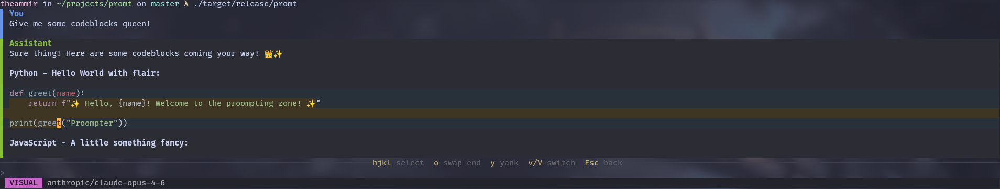

# promt - LLM chat, fzf-style

**This thing is fully vibe-coded with Claude Opus 4.6 via opencode.**
**If you want to use it, please be wary of the possibility of your computer
exploding in your face, right after sending all your data to ICE
(this is potentially deadly for you and your 'puter).**

I didn't want to write a TUI program again, and I didn't want to spend my
weekend actively thinking. So I outsourced it to Claude to potentially figure out whether
it's quicker to make a working piece of useful software this way.

It took me around 1.5 hours to get a finished prototype, but two more hours
before it could actually display chat messages and all planned functionality
actually somewhat worked.

So I've been stuck with it for 5-ish hours in total so far, and it has scrolling issues.
No worries, *promt*, I have my issues, too.

## Initial idea

Go look at [PLAN.md](PLAN.md), this is the initial idea.

Claude asked me a bunch of questions and we ended up overcomplicating the
entire thing from the very beginning.
I wanted an inline TUI tool, something like fzf, to quickly ask LLMs stuff in
my terminal seesions, and be able to browse, select and copy text within
Markdown codeblocks.

## So was it worth it?

TL;DR No idea. It kind of gets the job done, but now that I'm trying to make it
fix specific bugs, it adds debug statements and asks me to run the program,
repeat certain steps and bring it the output. It's like I'm the LLM agent
now...

## Learning opportunities I might have missed out on

- What API contracts of different inference providers look like in the industry
- Optimized text stream handling (dynamic syntax highlighting, maybe something else)

Idk what else??
